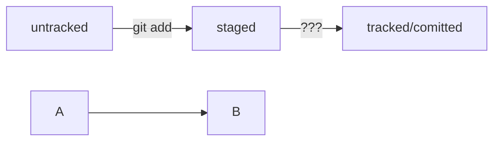

# Тренировка markdown

Выделение шрифта: **Это текст должен быть жирным**, *а этот курсиными*, ~~а этот зачеркнутым~~


Тренировка оформления списка:

1. Пункт 1
2. Пункт 2
3. Пункт 3 <br>

Этот текст начался с новой строки)?

А этот текст начался с другого параграфа?

[Я ссылка](https://www.yandex.ru "Ты меня видишь?")

Оформление кода <br>
```html
<h1>Заголовок</h1>
```

```css
h1 {
   color:black;
}
```

```
mkdir my_project
cd my_project
git init
```

